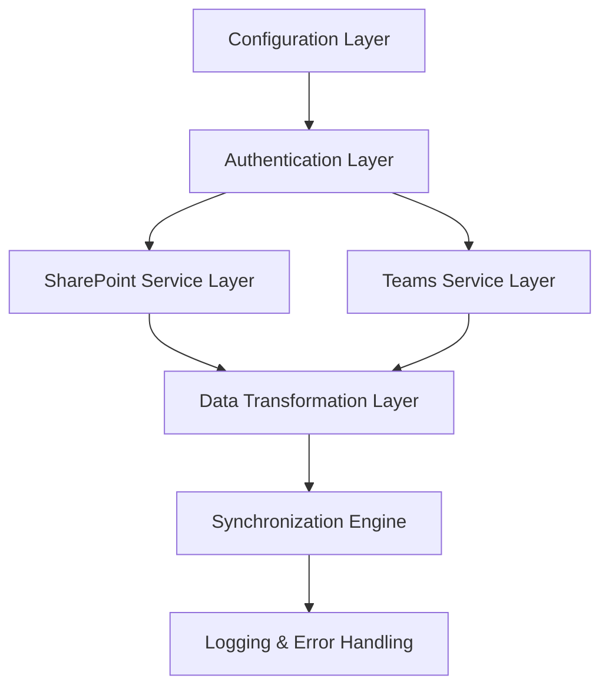

# Design Document

## Overview

The SharePoint Teams Integration tool is a Node.js application that connects to Microsoft SharePoint Online and Microsoft Teams via their respective REST APIs. The tool monitors specified SharePoint lists for changes and automatically creates corresponding todo items in Microsoft Teams. The architecture follows a modular design with clear separation of concerns for authentication, data retrieval, transformation, and todo creation.

## Architecture

The system follows a layered architecture pattern:



### Core Components

1. **Configuration Manager**: Handles SharePoint site URLs, list configurations, and field mappings
2. **Authentication Service**: Manages OAuth 2.0 flows for both SharePoint and Teams
3. **SharePoint Client**: Retrieves and monitors SharePoint list data
4. **Teams Client**: Creates and manages Teams todo items
5. **Data Transformer**: Maps SharePoint fields to Teams todo properties
6. **Sync Engine**: Orchestrates the synchronization process and prevents duplicates

## Components and Interfaces

### Authentication Service
```typescript
interface AuthenticationService {
  authenticateSharePoint(): Promise<AccessToken>
  authenticateTeams(): Promise<AccessToken>
  refreshToken(service: 'sharepoint' | 'teams'): Promise<AccessToken>
  isTokenValid(token: AccessToken): boolean
}
```

### SharePoint Client
```typescript
interface SharePointClient {
  getListItems(siteUrl: string, listName: string, filter?: string): Promise<SharePointItem[]>
  getListItemsSince(siteUrl: string, listName: string, since: Date): Promise<SharePointItem[]>
  validateSiteAccess(siteUrl: string): Promise<boolean>
}
```

### Teams Client
```typescript
interface TeamsClient {
  createTodo(todo: TeamsTodo): Promise<string>
  updateTodo(todoId: string, updates: Partial<TeamsTodo>): Promise<void>
  deleteTodo(todoId: string): Promise<void>
  getTodoById(todoId: string): Promise<TeamsTodo | null>
}
```

### Configuration Manager
```typescript
interface ConfigurationManager {
  getSharePointConfig(): SharePointConfig
  getTeamsConfig(): TeamsConfig
  getFieldMappings(): FieldMapping[]
  validateConfiguration(): ValidationResult
}
```

## Data Models

### SharePoint Item
```typescript
interface SharePointItem {
  id: string
  title: string
  description?: string
  dueDate?: Date
  assignedTo?: string[]
  status: string
  priority?: 'Low' | 'Medium' | 'High'
  createdDate: Date
  modifiedDate: Date
  etag: string
}
```

### Teams Todo
```typescript
interface TeamsTodo {
  id?: string
  title: string
  body?: string
  dueDateTime?: Date
  assignedTo?: string[]
  importance: 'low' | 'normal' | 'high'
  status: 'notStarted' | 'inProgress' | 'completed'
  sourceId: string // Reference to SharePoint item
}
```

### Configuration Models
```typescript
interface SharePointConfig {
  siteUrl: string
  lists: SharePointListConfig[]
  clientId: string
  tenantId: string
}

interface SharePointListConfig {
  name: string
  statusField: string
  triggerValues: string[]
  fields: string[]
}

interface FieldMapping {
  sharePointField: string
  teamsProperty: string
  transformer?: (value: any) => any
}
```

## Error Handling

### Error Categories
1. **Authentication Errors**: Token expiration, invalid credentials, insufficient permissions
2. **API Errors**: Rate limiting, service unavailability, malformed requests
3. **Data Errors**: Invalid field mappings, missing required fields, data type mismatches
4. **Network Errors**: Connectivity issues, timeouts, DNS resolution failures

### Error Handling Strategy
- Implement exponential backoff for rate limiting and temporary failures
- Use circuit breaker pattern for persistent API failures
- Queue failed operations for retry when services recover
- Provide detailed error logging with correlation IDs for troubleshooting

### Retry Logic
```typescript
interface RetryConfig {
  maxAttempts: number
  baseDelay: number
  maxDelay: number
  backoffMultiplier: number
}
```

## Testing Strategy

### Unit Testing
- Test each service class in isolation using mocks
- Validate data transformation logic with various input scenarios
- Test error handling paths and edge cases
- Mock external API calls to ensure predictable test results

### Integration Testing
- Test authentication flows with Microsoft APIs
- Validate SharePoint data retrieval with real test sites
- Test Teams todo creation and updates
- Verify end-to-end synchronization workflows

### Test Data Management
- Use dedicated test SharePoint sites and Teams instances
- Implement test data cleanup procedures
- Create representative test data covering various scenarios
- Use environment variables for test configuration

### Performance Testing
- Test with large SharePoint lists (1000+ items)
- Validate API rate limit handling
- Measure synchronization performance and memory usage
- Test concurrent operation handling

## Security Considerations

### Authentication Security
- Store OAuth tokens securely using encryption at rest
- Implement token rotation and secure storage
- Use least-privilege principle for API permissions
- Validate all configuration inputs to prevent injection attacks

### Data Privacy
- Ensure data is only accessed by authorized users
- Implement audit logging for all data access
- Respect SharePoint and Teams permission models
- Provide data deletion capabilities for compliance

### Network Security
- Use HTTPS for all API communications
- Validate SSL certificates
- Implement request signing where supported
- Use secure configuration storage (environment variables, key vaults)